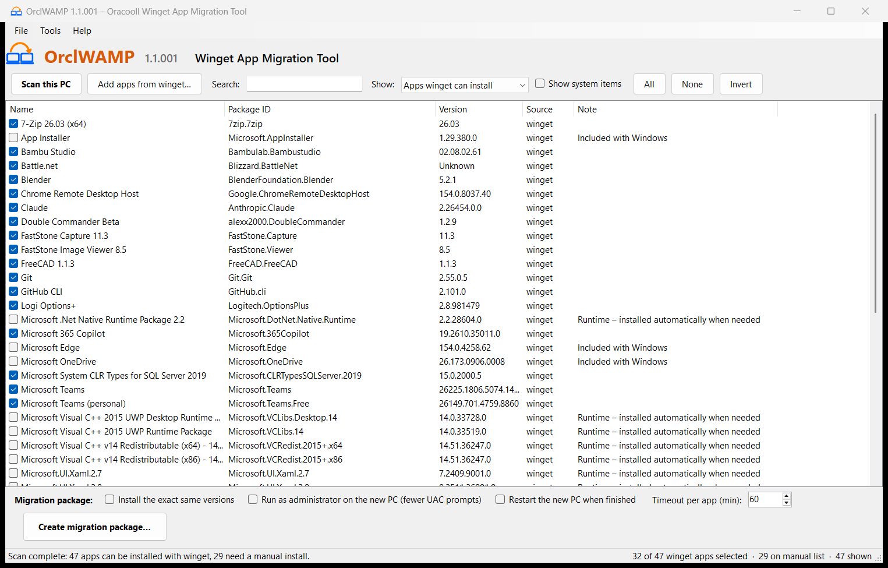
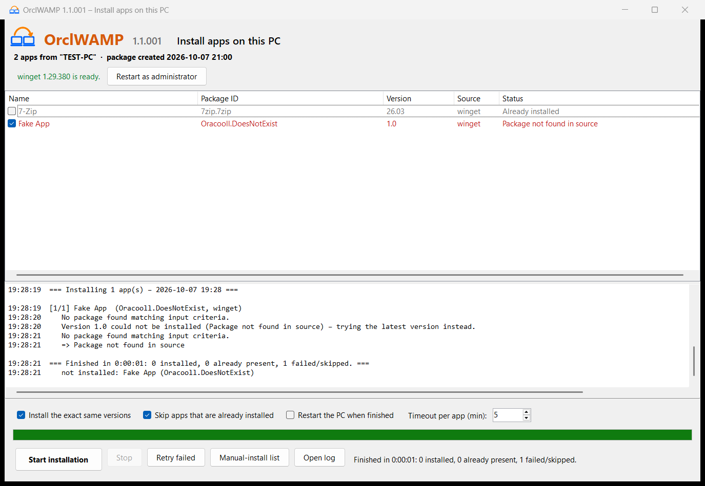

# OrclWAMP – Oracooll Winget App Migration Tool

**Version 1.1.001**

Moving to a new PC? OrclWAMP scans your old PC, finds every app that **winget** can install, and writes a migration folder to a USB stick. On the new PC you double-click one file and your apps install themselves.



- **Portable.** One ~140 KB exe with no installer and no dependencies. It uses .NET Framework 4.8, which is built into Windows 10 and 11.
- **One exe for both jobs.** The tool that scans the old PC is also the installer on the new one.

## Download

Get **OrclWAMP.exe** from the [latest release](https://github.com/Oracooll/OrclWAMP/releases/latest).

> Windows SmartScreen may warn you because the exe isn't code-signed. Click **More info → Run anyway**.

## How to use it

### On the old PC
1. Run `OrclWAMP.exe`. It scans the PC automatically.
2. Check the list:
   - **Apps winget can install** are ticked. Runtimes (VC++, .NET, WindowsAppRuntime…) and apps that ship with Windows (Edge, OneDrive…) start unticked.
   - **Apps to install manually** have no winget package. Ticked ones go into an HTML checklist so you don't forget them.
3. Optionally use **Add apps from winget…** to add apps this PC doesn't have.
4. Click **Create migration package…** and choose your USB drive.

### On the new PC
1. Connect to the internet.
2. Open the `OrclWAMP-Migration` folder on the USB stick and double-click **Install.cmd** (or `OrclWAMP.exe`).
3. Check the list and click **Start installation**.
4. Open the **Manual-install list** for anything winget couldn't handle.



## Features

| | |
|---|---|
| Smart scan | `winget list` + `winget export`. Exact package IDs, duplicates removed, per-language Office entries collapsed |
| Sensible defaults | Runtimes and apps that come with Windows start unticked. System components are hidden |
| Search, filter, sort | Live search, view filter, sortable columns, All / None / Invert, right-click actions |
| Add from winget | Search the winget catalog inside the app and add any package |
| Profiles | Save or load app lists (`.json`). Standard `winget export` files can be opened too |
| CSV export | Full inventory of the old PC |
| Manual-install report | HTML checklist with a web-search link for every app winget can't install |
| winget check and repair | On the new PC, re-registers App Installer or downloads it from Microsoft if winget is missing |
| Skips installed apps | Apps already on the new PC are detected and skipped |
| Robust installs | Silent installs, per-app timeout, keeps going after errors, retries automatically when another install is in progress, **Retry failed**, readable error messages |
| Elevation | Optional one-time UAC prompt at the start, so installers don't each ask. Warns if the admin account isn't the signed-in user |
| Exact versions | Optionally pin the old versions. Falls back to the latest if a version is gone |
| Keeps PC awake | Sleep is blocked while installing. Optional restart when finished |
| Logs | Each restore run writes a log next to the package |
| Fallbacks | `winget-packages.json` (for `winget import`) and a plain `Install-Fallback.ps1` |
| Command line | Unattended restore and headless scan/package for IT use |

## Command line

```
OrclWAMP.exe                        Scan this PC (or restore, if a package file is next to the exe)
OrclWAMP.exe /scan                  Always open the scanner
OrclWAMP.exe /restore [file]        Install apps from a migration package
OrclWAMP.exe /restore /unattended   Install everything without asking
OrclWAMP.exe /package <folder>      Scan and write a migration package without UI
OrclWAMP.exe /csv <file>            Scan and save the app list as CSV without UI
```

## What's in the migration folder

| File | Purpose |
|---|---|
| `OrclWAMP.exe` | The tool itself. It starts in restore mode when it finds the package file next to it |
| `OrclWAMP-packages.json` | The app list and options |
| `Install.cmd` | Starts restore mode |
| `winget-packages.json` | Standard winget file: `winget import -i winget-packages.json` |
| `Install-Fallback.ps1` | Plain PowerShell installer, if the exe can't run |
| `Manual-Install-Report.html` | Apps to install by hand |
| `README.txt` | Short instructions |

## Building from source

You need Windows and the C# compiler from Visual Studio 2019 or later, or the free *Build Tools for Visual Studio*.

```powershell
./build.ps1              # -> bin\OrclWAMP.exe
./tools/make-icon.ps1    # regenerate assets\OrclWAMP.ico + logo.png from assets\OrclWAMP.png
```

GitHub Actions builds every push and attaches the exe to tagged releases.

## Limitations
- Only apps with a winget (or Microsoft Store) package can be installed automatically.
- App settings, licences and data are **not** migrated.
- Some installers ignore `--silent` and show their own window, or need a restart.

## License
MIT – see [LICENSE](LICENSE).
